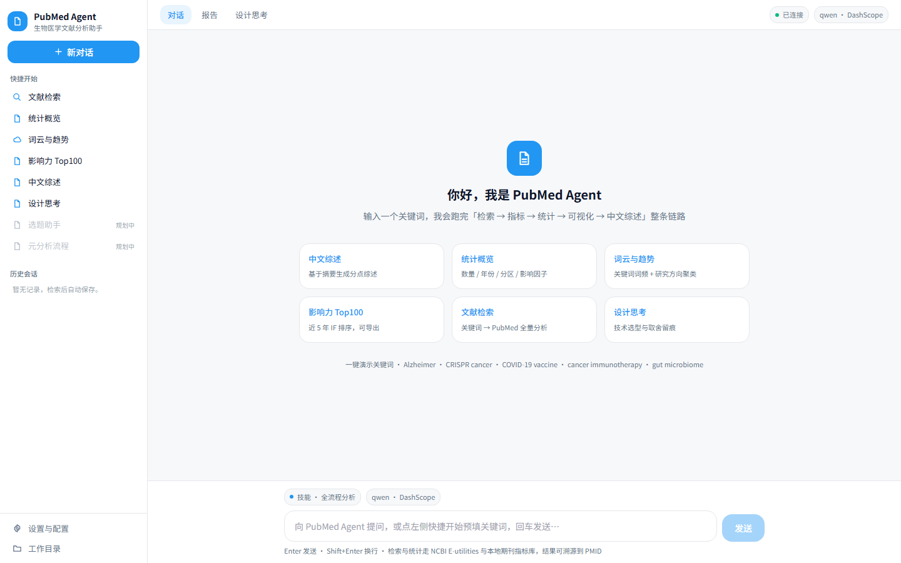
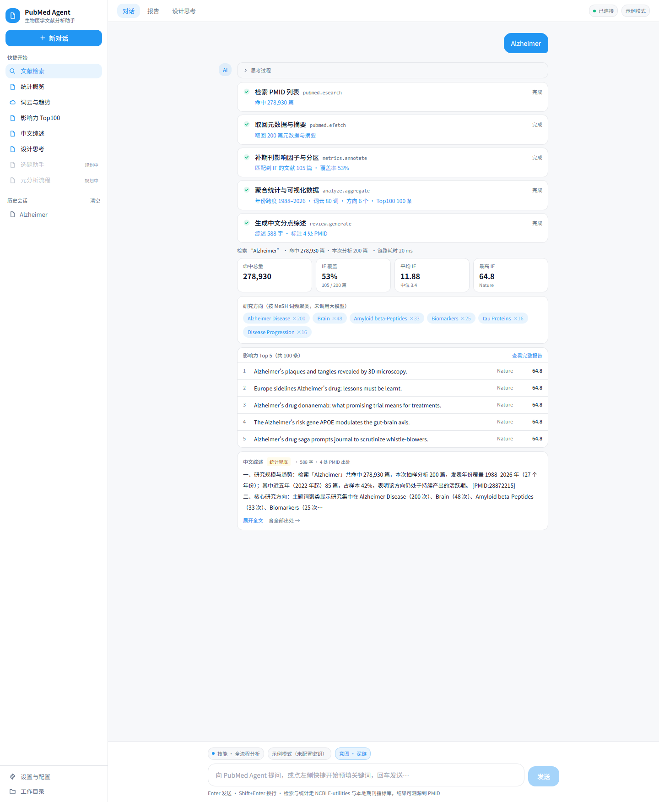
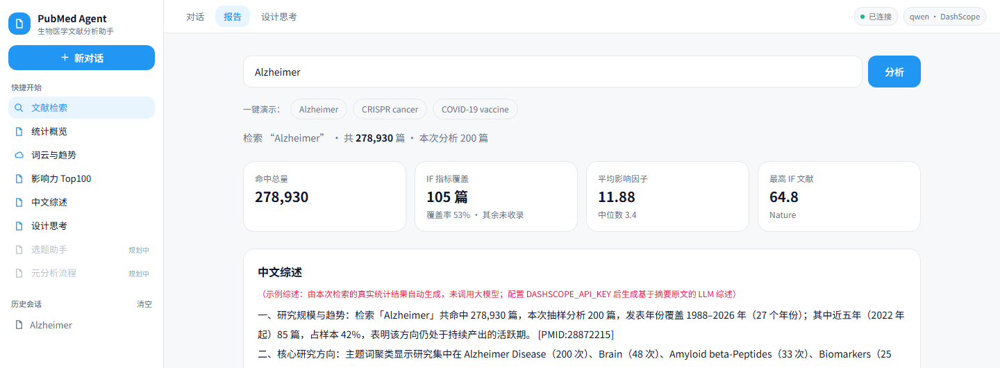
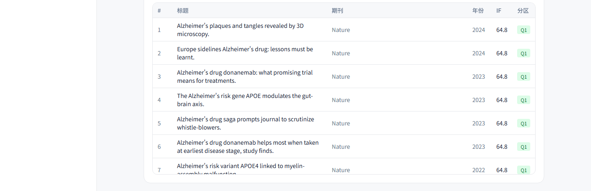

# PubMed Agent · 文献分析 Demo（全栈笔试）

> 沿长科技（成都）全栈开发工程师笔试 —— 关键词 → NCBI 检索 → 统计 + 词云 + 影响力排序 + 中文综述 一站式 web。
> 当前状态：**F1–F4 + 对话式外壳 + 设计思考页 全部完成**并端到端跑通；架构为**单 LLM**（非 RAG、非多智能体），**零数据库、零向量库**。
> 外层是对话式 Agent 外壳（左导航 + 对话流 + 工具调用可见），内核仍是那条已端到端验证过的固定流水线——**升级只加了一层壳，报告链路一行未改**。

## 界面预览

对话式外壳（左侧导航 + 中间对话流 + 工具调用可见）：

| 欢迎页（快捷开始 + 能力卡） | 对话流（工具卡片 + 结果内联） |
|---|---|
|  |  |

「报告」视图（原 F1–F4 完整报告，逻辑未改，只是搬进了独立视图）：

| 概览（检索 + 统计卡 + 中文综述） | 年份分布 / 分区分布 |
|---|---|
|  |  |

| 词云 + 研究方向标签 | 影响力 Top 100 |
|---|---|
|  |  |

## 功能范围（已完成）
- ✅ **对话式外壳**：三栏布局（左导航 / 顶部视图切换 / 主区）、快捷开始、历史会话（localStorage）、输入区技能与模型 chips、后端连接状态实时检测
- ✅ **工具调用可见**：每步渲染为一张工具卡片（名称与入参对齐后端真实函数，结果值取自真实响应），思考过程可折叠，结果内联渲染并可跳转完整报告
- ✅ 关键词 → NCBI E-utilities 真实检索（ESearch + EFetch/XML 并发解析）
- ✅ **F1 统计**：命中总量、年份分布（Alzheimer 场景覆盖 1988→2026）、期刊分区分布（Q1–Q4 + 未知）、影响因子统计（均值/中位/极值）、IF 指标覆盖率
- ✅ **F2 可视化**：关键词词云（纯 DOM 渲染，字号∝词频、色阶分档）+ 研究方向标签（MeSH 聚类，纯统计不用 LLM）
- ✅ **F3 排序**：影响因子 Top 100 表格（近 5 年优先，样本不足时按年份就近补足并标注）+ 一键 CSV 导出
- ✅ **F4 综述**：取 Top 摘要 → 中文分点综述（约 500 字），每条论断可溯源 `[PMID: xxxxx]`
- ✅ 设计思考页（含界面升级与工具卡片边界的说明，命中"体现对该工具的思考"加分项）
- ✅ 前端现代 SaaS 风格（浅色卡片化），三栏外壳与原报告视图共用同一套设计 token

## 技术栈
- 后端：Python + FastAPI + httpx（异步并发）+ python-dotenv
- 数据源：NCBI E-utilities（免费，可挂 `NCBI_API_KEY` 提限流）
- 期刊指标：内置 `data/journal_metrics.json`（**1324 本期刊、2639 条 ISSN**，OpenAlex 开放指标 + 策展补录，缺失降级"未知"，详见「数据来源」）
- 综述 LLM：DashScope qwen（OpenAI 兼容接口），无 key 时按真实统计生成示例综述
- 前端：Vite + React + TypeScript + Tailwind CSS + ECharts（**按需注册**：bar/pie/grid/tooltip/legend）+ 自研 DOM 词云
- 存储：无数据库；内置静态指标 + 进程内存缓存 + 文件预缓存 + 浏览器 localStorage（仅历史会话）

## 目录结构
```
pubmed-analytics/
├── backend/
│   ├── app/
│   │   ├── config.py      # 环境变量与配置
│   │   ├── pubmed.py      # NCBI 检索（esearch + efetch 批量 XML 解析）
│   │   ├── metrics.py     # 期刊指标加载与刊名/ISSN 归一化匹配（缺失降级）
│   │   ├── analyze.py     # 聚合：年份/分区/IF/词频/主题/Top100
│   │   ├── review.py      # 中文综述（qwen / 按真实统计生成的示例综述）
│   │   ├── pipeline.py    # 检索→聚合→综述 统一响应体（main 与 precache 共用）
│   │   └── main.py        # FastAPI 入口 + /api/analyze + CORS + 缓存
│   ├── data/journal_metrics.json          # 期刊指标数据集（见「数据来源」）
│   ├── scripts/gen_metrics.py             # 手工策展数据集初始生成
│   ├── scripts/build_metrics_openalex.py  # 用 OpenAlex 开放数据扩充指标集（含全部 ISSN）
│   ├── scripts/add_curated_extras.py      # 高频缺失刊离线策展补录（幂等）
│   ├── scripts/precache.py                # 演示预缓存生成（PRESETS 跑真实管线写 cache/）
│   ├── cache/                             # 演示预缓存（启动自动载入内存）
│   ├── .env.example       # 配置模板
│   ├── requirements.txt
│   └── .venv/             # 已建虚拟环境（阿里云 PyPI 镜像）
├── frontend/
│   ├── src/App.tsx        # 入口：仅挂载外壳
│   ├── src/ReportView.tsx # 「报告」视图 = 原 F1–F4 报告逻辑整体迁移（未改逻辑）
│   ├── src/Thinking.tsx   # 设计思考页
│   ├── src/api.ts         # 调 /api/analyze（类型定义）
│   ├── src/EChart.tsx     # ECharts 封装（按需注册 + ResizeObserver 自适应）
│   ├── src/WordCloud.tsx  # 自研纯 DOM 词云（无 canvas 插件依赖）
│   ├── src/agent/         # 对话式外壳（本次新增，自包含，不侵入既有模块）
│   │   ├── AgentShell.tsx # 三栏骨架 + 视图切换 + 会话状态 + 连接检测
│   │   ├── Sidebar.tsx    # 左导航：品牌 / 新对话 / 快捷开始 / 历史 / 配置 / 工作目录
│   │   ├── ChatPanel.tsx  # 对话流 + 输入区 + 工具卡片推进编排
│   │   ├── ToolCard.tsx   # 工具调用卡片（入参可展开）
│   │   └── model.ts       # 数据模型 + 快捷开始定义 + 工具模板 + 会话持久化
│   └── dist/              # 已 build（591 模块 / gzip 226 KB）
├── docs/                  # 界面截图（README 引用）
└── .gitignore             # 排除 node_modules / .venv / dist / .env / cache
```

## 快速启动

### 1. 后端
```bash
cd backend
cp .env.example .env        # 可选：填 DASHSCOPE_API_KEY 用真实 qwen；留空则按真实统计生成示例综述
.venv/Scripts/pip.exe install -r requirements.txt   # 已装好

# 不配任何 key 也能完整演示（现场推荐）：
MOCK_LLM=1 .venv/Scripts/uvicorn.exe app.main:app --host 127.0.0.1 --port 8000
# 真实 LLM 模式（在 .env 填好 DASHSCOPE_API_KEY）：
.venv/Scripts/uvicorn.exe app.main:app --host 127.0.0.1 --port 8000

# 离线预生成演示缓存（一键演示不翻车；建议演示前在能联网的环境跑一次，约 15 秒）：
MOCK_LLM=1 .venv/Scripts/python.exe scripts/precache.py
# 启动后后端自动从 cache/*.json 载入内存；前端「一键演示」按钮直接命中，断网也能秒回

# 验证：
curl http://127.0.0.1:8000/api/health
curl -X POST http://127.0.0.1:8000/api/analyze -H "Content-Type: application/json" \
  -d "{\"query\":\"Alzheimer\",\"max_results\":200,\"include_review\":true}"
```

### 2. 前端
```bash
cd frontend
npm install            # 已装好（react / echarts 已含）
npm run dev            # 开发服务器 http://127.0.0.1:5173
# 或生产预览：
npm run build && npm run preview
```
> 前端 `api.ts` 直连 `http://localhost:8000`（演示时改 hosts/端口一致即可）。
> **深链**（现场演示可直接进任意视图）：
> - `/?q=Alzheimer` → 报告视图并自动分析（升级前的既有行为，已保留）
> - `/?chat=Alzheimer` → 对话视图并自动跑一次完整链路
> - `/?tab=design` → 直接进设计思考页

## 配置项（.env）
| 变量 | 说明 | 默认 |
|---|---|---|
| `DASHSCOPE_API_KEY` | 阿里云百炼 qwen key（真实综述） | 空=按统计生成示例 |
| `DASHSCOPE_BASE_URL` | DashScope OpenAI 兼容地址 | https://dashscope.aliyuncs.com/compatible-mode/v1 |
| `LLM_MODEL` | 模型名 | qwen-plus |
| `NCBI_API_KEY` | NCBI E-utilities key（提限流） | 空 |
| `NCBI_TOOL` / `NCBI_EMAIL` | 礼貌参数 | pubmed-analytics |
| `MAX_RESULTS` | 检索上限 | 1000 |
| `REVIEW_TOP_N` | 综述取摘要篇数 | 30 |
| `MOCK_LLM` | 强制走示例综述 | 无 key 自动 true |
| `CACHE_DIR` | 文件预缓存目录 | `backend/cache` |

## 数据来源（期刊 IF / 分区）

PubMed 官方不返回影响因子与分区，因此指标数据集在**构建期**生成、随包发布，运行时零联网依赖：

| 来源 | 说明 |
|---|---|
| `curated` | 手工整理的 131 本主流刊，2023 JCR 近似值（主数据集初始种子） |
| `openalex` | OpenAlex sources API（开放数据）拉取的高产出/高被引期刊，含**全部 ISSN（印刷+电子）**，`2yr_mean_citedness` 作为 IF 近似 |
| `curated-extra` | 针对演示样例中高频出现但未被收录的期刊做人工补录（如 Journal of Alzheimer's Disease、Trends in Cancer） |

- 当前规模：**1324 本期刊、2639 条 ISSN**；分区规则：`IF>=6 Q1 / 3~6 Q2 / 1.5~3 Q3 / <1.5 Q4`（阈值近似，**非官方 JCR 分区**，仅供演示）。
- 刊名匹配做了归一化，抹平 PubMed 的 5 种常见写法差异：`括号限定词`（Science (New York, N.Y.)）、`句点`（Nature reviews. Cancer）、`主标题 : 缩写`（Journal of Alzheimer's disease : JAD）、`标题 = 平行标题`、`开头缩写前缀`（JPMA. ...）。
- 未收录期刊如实降级为「未知」，不编造数值；前端概览卡展示 **IF 指标覆盖率**。
- 重新生成：`python scripts/build_metrics_openalex.py`（需联网，OpenAlex 对单 IP 限流较严，脚本内置 429 长退避）、`python scripts/add_curated_extras.py`（离线幂等补录）。

## 技术取舍（为什么这么做）
| 决策点 | 选择 | 理由 |
|---|---|---|
| 界面形态 | **网页内做对话式外壳**，不做桌面应用 | 笔试要求是「独立开发一个网页 demo」；桌面壳（Electron）会偏离要求且演示成本更高。参考了科研 Agent 类产品的交互范式，但只取其"过程可见"的内核，形态仍留在浏览器里。 |
| 升级边界 | **只加外壳，不动报告链路** | 报告链路已端到端验证过，为换皮重写它风险与收益不成比例。做法是把原报告逻辑整体迁到 `ReportView.tsx` 作为独立视图，**逻辑一行未改**，对话只是新的入口层。 |
| 工具卡片 | 卡片**对齐后端真实函数**，结果值取自真实响应 | 卡片名与入参直接用 `pubmed.esearch` / `pubmed.efetch` / `metrics.annotate` / `analyze.aggregate` / `review.generate`，顺序即真实执行顺序；数值全部来自 `/api/analyze` 响应。**需如实说明**：后端目前是一次性返回，故卡片"逐步点亮"是前端按真实阶段做的回放、不是服务端推送；汇总行显示的是**接口真实往返耗时**而非播放时长。下一步改 SSE 增量推送即可去掉回放层。 |
| 快捷开始清单 | 6 项真实能力 + 2 项显式标注「规划中」 | 把没做的东西列成已完成，在演示追问下必然被问穿；不如当路线图如实交底（选题助手 / 元分析流程尚未实现）。 |
| 词云实现 | **自研纯 DOM**（不用 echarts-wordcloud） | canvas 词云依赖容器实测宽高做贪心排版：SPA 首帧尺寸未稳、图表重绘、无头截图等场景下容易整块画不出来，排布结果也不可预期。改为 DOM 文本流后：字号按词频 `sqrt` 压缩（15~41px，长尾词不会被压成噪点）、颜色按频率分 4 档品牌蓝且**与字号严格对应**（避免"字大色浅"的视觉错位），渲染确定、无空白面板风险，文字还可选中/检索/缩放不糊。只取词频前 36 个词——词太多会把容器塞满小字反而看不清层次。 |
| ECharts 引入方式 | **按需注册**（core + bar/pie/grid/tooltip/legend） | 全量 `import "echarts"` 打包 1.19 MB；按需后 **675 KB（gzip 226 KB）**，体积减少 43%。代价是新增图表类型需手动补注册，已在 `EChart.tsx` 注释说明。 |
| 分区标准 | 阈值近似（IF≥6 Q1 / 3–6 Q2 / 1.5–3 Q3 / <1.5 Q4） | JCR 为付费数据、无开放接口；SCImago 站点对本机 IP 返回 403。故用 IF 阈值近似并在 UI 明确标注「非官方 JCR」，不误导使用者。 |
| 期刊指标 | 构建期落盘 + 运行期零联网 | 演示现场网络不可控；指标在构建期生成成 `journal_metrics.json` 随包发布，运行时只读本地，未收录期刊如实降级"未知"而非编造数值。 |
| 综述生成 | 单次 LLM 调用（非 RAG / 非多智能体） | 输入是已检索到的 Top-N 摘要（自带上下文），无需向量库检索；单次调用延迟低、链路短。多智能体/RAG 的数据量与调试成本对 demo 不成正比。 |
| 无 key 时的综述 | 用**真实统计**拼装分点综述 | 空 key 场景下若返回一段与数据无关的占位话，F4 就没法看。改为把命中量、年份跨度、主题聚类、分区与 IF 分布写成 4~5 点并附真实 PMID 出处（588~640 字），现场不配 key 也能展示 F4 的实际形态；是否调用大模型由响应体 `mock` 字段标记、前端据此提示。 |
| 检索排序 | `sort=relevance`（非 `pub_date`） | 按时间倒序会让样本全部挤在最近年份，年份分布退化成"1–2 根柱子"；改相关性排序后年份跨度达 1988→2026，分布图才有分析价值。 |
| 会话持久化 | 浏览器 localStorage（未落库） | 本次只在壳层，历史会话属于 UI 态；为它引入后端存储会扩大改动面。后续落库支持跨设备（见设计思考页路线图）。 |

## 验证结果（最新一轮全链路）
- **检索**：真实调 NCBI E-utilities，各取前 200 篇分析——Alzheimer 命中 **278,930** 篇 / CRISPR cancer **18,118** / COVID-19 vaccine **61,228**。
- **F1 统计**：年份分布 Alzheimer 1988→2026（27 个年份）、CRISPR cancer 2014→2027、COVID-19 vaccine 2020→2025（改用 `sort=relevance` 后已从"1–2 根柱子"修复）；分区分布 Q1/Q2/Q3/Q4 + 未知；IF 统计均值/中位/极值齐备（Alzheimer 均值 11.88、中位 3.4、最高 64.8）。
- **F2 可视化**：词云（Alzheimer 场景：disease / alzheimer / brain / amyloid / dementia / biomarkers…，共 80 词）+ MeSH 研究方向标签（Alzheimer Disease ×200、Brain ×48、Amyloid beta-Peptides ×33、Biomarkers ×25，已过滤 Humans/Animals 等泛词）。
- **F3 Top100**：三个预设均返回 **100 条**并支持 CSV 导出（Alzheimer 近 5 年仅 96 篇，已按年份就近补足，界面标注「补」）。
- **F4 综述**：无 key 时返回基于本次真实统计的中文分点综述 **588~640 字**（含命中量、年份跨度、主题聚类、分区与 IF 分布 + 真实 PMID 出处）；配置 `DASHSCOPE_API_KEY` 后改为基于摘要原文的 LLM 综述。响应体带 `mock` 标记，前端据此提示，不冒充 LLM 输出。
- **指标覆盖**：Alzheimer 52.5% / CRISPR cancer 81.5% / COVID-19 vaccine 49.0%（未收录的长尾刊降级"未知"，界面明示覆盖率）。
- **对话外壳**：工具卡片 5 步的结果值与后端实测逐项一致（命中 278,930 / 取回 200 篇 / 匹配到 IF 105 篇即 53% / 词云 80 词 · 方向 6 个 · Top100 100 条 / 综述 588 字 · 4 处 PMID），无编造数值。
- **性能**：3 个预设命中预缓存 **6–24ms 秒回**（断网也能演示）；前端 `npm run build` 591 模块通过，产物 gzip 226 KB。
- **渲染**：已用真实浏览器（headless Chrome）逐屏截图核验外壳欢迎页、对话流工具卡片、报告总览/图表/词云/Top100，无空白面板（截图见 `docs/`）。

## 已知优化点（非阻塞）
- **工具卡片是前端回放而非服务端流式**（后端 `/api/analyze` 为一次性返回）。要变成真流式需改 SSE 增量推送；这是实现细节，不影响功能完整度，但演示时若被问需如实说明。
- IF 指标覆盖率受数据集规模限制（1324 本），长尾小刊仍显示"未知"——属设计内降级，前端已明示覆盖率。进一步提升需扩大 OpenAlex 抓取页数（受其单 IP 限流约束，建议分批多次）。
- 分区是**阈值近似**而非官方 JCR 分区（JCR 为正版付费数据，无免费开放接口）。
- 打包后仍有 675 KB（echarts 运行时本体），如需进一步压缩可做 `manualChunks` 拆包 + 路由级懒加载；当前单页应用收益有限，未做。
- 真实 LLM 综述需填 `DASHSCOPE_API_KEY`（笔试可报销额度内）。
- `config.CACHE_TTL` 已定义但当前代码未引用，缓存实际不过期——演示场景下是有意为之（预缓存不失效），如需生产化需接入过期判定。

## 演示建议
1. 演示前在能联网环境跑一次 `scripts/precache.py` 生成缓存（现场断网也能秒出）。
2. 启动后端（`MOCK_LLM=1` 即可）+ 前端 `npm run dev`。
3. **动线**：① 对话视图欢迎页讲外壳与快捷开始 → ② 点「文献检索」预填关键词并发送，看 5 张工具卡片推进与结果内联 → ③ 点「查看完整报告」切到报告视图，展开图表 / 词云 / Top100 → ④ 导出 CSV → ⑤ 切设计思考页讲取舍。
4. 讲解主线：过程可见 + 一站式 + 中文优先 + 数据可溯源（每段综述跳 PMID）+ 工程取舍（见「技术取舍」）。
5. 若被问到工具卡片的真实性，直接指 `frontend/src/agent/model.ts` 顶部的注释与 `ToolCard` 的数据来源，如实说明回放与流式的差别。
